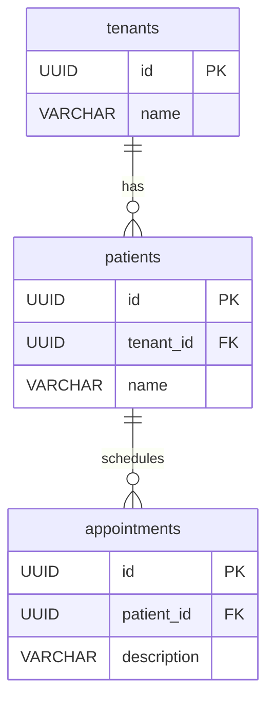

# Phase 01 - Multi-Tenant Schema

## Objective

Create a simple multi-tenant data model before introducing Row Level Security (RLS).

## Schema



[Create script](../sql/02-multi-tenant-schema.sql)

### Seed Data
*Example: UUID values are auto-generated and will differ in each execution.*

#### Tenant

```sql
rls_lab=# INSERT INTO tenants (name)
VALUES
    ('Tenant A'),
    ('Tenant B');
```

#### Patients

```sql
rls_lab=# INSERT INTO patients (tenant_id, name)
VALUES
    ('813d31c5-5116-4fea-b4b8-eb06ce7e773c', 'João'),
    ('f46c8eb7-4b1b-4ba6-8f53-734edf04d328', 'Maria'); 
```

#### Appointments

```sql
rls_lab=# INSERT INTO appointments (patient_id, description)
VALUES
    ('cfb6ceaf-6fbf-4174-ac84-a877cb19262a', 'Cardiologist'),
    ('cfb6ceaf-6fbf-4174-ac84-a877cb19262a', 'Follow-up'),
    ('f241beeb-1f80-4059-8643-fabd1d7a4214', 'Orthopedic'),
    ('f241beeb-1f80-4059-8643-fabd1d7a4214', 'Exam Review');
```

### Experiments

#### List tenants

```sql
rls_lab=# SELECT * FROM tenants;
                  id                  |   name   
--------------------------------------+----------
 813d31c5-5116-4fea-b4b8-eb06ce7e773c | Tenant A
 f46c8eb7-4b1b-4ba6-8f53-734edf04d328 | Tenant B
(2 rows)
```

#### List patients

```sql
rls_lab=# SELECT * FROM patients;
                  id                  |              tenant_id               | name  
--------------------------------------+--------------------------------------+-------
 cfb6ceaf-6fbf-4174-ac84-a877cb19262a | 813d31c5-5116-4fea-b4b8-eb06ce7e773c | João
 f241beeb-1f80-4059-8643-fabd1d7a4214 | f46c8eb7-4b1b-4ba6-8f53-734edf04d328 | Maria
(2 rows)
```

#### List appointments

```sql
rls_lab=# SELECT * FROM appointments;
                  id                  |              patient_id              | description  
--------------------------------------+--------------------------------------+--------------
 000ceea3-56ce-41d1-960a-15675db02e52 | cfb6ceaf-6fbf-4174-ac84-a877cb19262a | Cardiologist
 0c9f8a53-0f67-449d-9717-9a49351573b5 | cfb6ceaf-6fbf-4174-ac84-a877cb19262a | Follow-up
 72bd338b-49fa-4db1-bb10-8ce0cc7f3636 | f241beeb-1f80-4059-8643-fabd1d7a4214 | Orthopedic
 fd893c13-ef8b-4ac2-a619-890340a48001 | f241beeb-1f80-4059-8643-fabd1d7a4214 | Exam Review
(4 rows)
```

#### Join all entities

```sql
rls_lab=# SELECT
    t.name AS tenant,
    p.name AS patient,
    a.description
FROM tenants t
INNER JOIN patients p
    ON t.id = p.tenant_id
INNER JOIN appointments a
    ON a.patient_id = p.id;


  tenant  | patient | description  
----------+---------+--------------
 Tenant A | João    | Cardiologist
 Tenant A | João    | Follow-up
 Tenant B | Maria   | Orthopedic
 Tenant B | Maria   | Exam Review
(4 rows)
```


## Ownership Analysis

### Patient Ownership

Patients contain a direct tenant reference through the `tenant_id` column.

```text
Tenant
    ↓
Patient
```

### Appointment Ownership
Appointments do not contain a tenant_id column.
To determine tenant ownership, PostgreSQL must navigate the relationship chain:

```text
Appointment
    ↓
Patient
    ↓
Tenant
```

Because of this design, protecting appointments with RLS will be more complex than protecting patients.

## Key Learnings

- Multi-tenant applications commonly store data from multiple tenants in the same tables.
- Patients have a direct relationship with tenants through the `tenant_id` column.
- Appointments do not contain a tenant identifier.
- Tenant ownership of an appointment must be inferred through the patient relationship.
- Without RLS, queries can access data belonging to all tenants.
- Understanding ownership chains is essential before implementing RLS policies.

## Conclusion

At this stage, data from multiple tenants coexist in the same tables and can be accessed by any query.
No isolation mechanism exists yet.
The next phase introduces PostgreSQL Row Level Security (RLS) to enforce tenant isolation at the database level.